<!-- Hero Banner -->

<!-- Quotes Banner -->

 

---

## 👋 About Me | Giới Thiệu

🇻🇳 **Xin chào! Tôi là Tuấn (qtuwn)**

> _Một lập trình viên đam mê xây dựng các ứng dụng thực tế với code sạch và kiến trúc rõ ràng._

🌏 **Hello! I'm Tuan (qtuwn)** — A passionate developer building real-world applications.

- 💼 **Focus:** Web & Mobile Development, Desktop Apps
- 🔧 **Experience:** C# WinForms, ASP.NET, PHP/WordPress, React/Node.js
- 📱 **Mobile:** Flutter/Dart
- 🗃️ **Databases:** SQL Server, MySQL, MongoDB, Firebase
- 🐳 **DevOps:** Docker, Linux, Vercel, GitHub Actions
- 📊 **PM Tools:** Jira, Trello
- 🌱 **Learning:** Python for Machine Learning
- 🛠️ **Local Dev:** XAMPP, Laragon

 

---

## 🛠️ Tech Stack

### 🌐 Web Development

### 📱 Mobile Development

### 💻 Desktop & Backend

### 🗃️ Databases

### 🐳 DevOps & Cloud

### 📋 Project Management

### 🌱 Currently Learning

### 🔧 Dev Tools

---

## 📊 GitHub Stats

  
  

  

---

## 🐍 Contribution Snake

---

## 🚀 Featured Projects

| 🏷️ Project | 📝 Description | 🛠️ Tech |
|:---:|:---|:---:|
| [**📱 Calories-App**](https://github.com/qtuwn/Calories-App) | Mobile app for tracking daily calories and nutrition | `Flutter` `Dart` `Firebase` |
| [**🧋 MilkTeaManager**](https://github.com/qtuwn/MilkTeaManager) | Desktop management system for milk tea shop operations | `C#` `WinForms` `.NET` `SQL Server` |
| [**💬 ecommerce-live-support**](https://github.com/qtuwn/ecommerce-live-support) | Real-time live chat support for e-commerce platforms | `Node.js` `React` `Socket.IO` `MongoDB` |
| [**🏠 websitenoithat_hanokihome**](https://github.com/qtuwn/websitenoithat_hanokihome) | Furniture e-commerce website | `PHP` `MySQL` `WordPress` |

---

## 🤝 Collaboration Projects

| 🏷️ Project | 📝 Description | 🛠️ Tech |
|:---:|:---|:---:|
| [**🍽️ DinerChill**](https://github.com/NotVNT/DinerChill) | Restaurant ordering and management system | `C#` `.NET` `SQL Server` |
| [**🧋 MilkTea**](https://github.com/NotVNT/MilkTea) | Milk tea shop management application | `C#` `WinForms` `.NET` |
| [**📋 MilkTeaOrder**](https://github.com/NotVNT/MilkTeaOrder) | Order processing system for milk tea shops | `C#` `.NET` `SQL Server` |
| [**🥤 OrderMilkTeaProgram**](https://github.com/Vizzy-san/OrderMilkTeaProgram) | Milk tea ordering program | `C#` `WinForms` `.NET` |
| [**🛋️ FurnitureStore**](https://github.com/NotVNT/FurnitureStore) | Furniture store management system | `C#` `.NET` `SQL Server` |

---

## 📫 Contact

---

  
### 💡 *"Build real apps. Ship often. Keep learning."*

 

